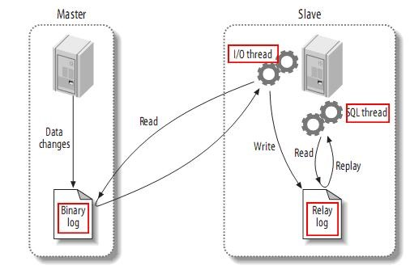

# 主从同步

配置主从同步原因：

1. 数据备份，高可用

2. 配合读写分离，提高吞吐量

## 实现步骤

1. master将改变记录到二进制日志(binary log)中（这些记录叫做二进制日志事件，binary log events）；
2. slave将master的binary log events拷贝到它的中继日志(relay log)；
3. slave重做中继日志中的事件，将改变反映它自己的数据。



该过程的第一部分就是master记录二进制日志。在每个事务更新数据完成之前，master在二日志记录这些改变。MySQL将事务串行的写入二进制日志，即使事务中的语句都是交叉执行的。在事件写入二进制日志完成后，master通知存储引擎提交事务。

下一步就是slave将master的binary log拷贝到它自己的中继日志。首先，slave开始一个工作线程——I/O线程。I/O线程在master上打开一个普通的连接，然后开始binlog dump process。Binlog dump process从master的二进制日志中读取事件，如果已经跟上master，它会睡眠并等待master产生新的事件。I/O线程将这些事件写入中继日志。

SQL slave thread处理该过程的最后一步。SQL线程从中继日志读取事件，更新slave的数据，使其与master中的数据一致。只要该线程与I/O线程保持一致，中继日志通常会位于OS的缓存中，所以中继日志的开销很小。

此外，在master中也有一个工作线程：和其它MySQL的连接一样，slave在master中打开一个连接也会使得master开始一个线程。

**利用主从在达到高可用的同时，也可以通过读写分离提供吞吐量。**

## 配置步骤

```
有很多种配置主从同步的方法，可以总结为如下的步骤：
（1） 在主服务器上，必须开启二进制日志机制和配置一个独立的 ID
（2） 在每一个从服务器上，配置一个唯一的 ID，创建一个用来专门复制主服
务器数据的账号
（3） 在开始复制进程前，在主服务器上记录二进制文件的位置信息
（4） 如果在开始复制之前，数据库中已经有数据，就必须先创建一个数据快照
（可以使用 mysqldump 导出数据库，或者直接复制数据文件）
（5） 配置从服务器要连接的主服务器的 IP 地址和登陆授权，二进制日志文件
名和位置
```

## 详细方法

主和从的身份可以自己指定，我们将Ubuntu虚拟机中MySQL作为主服务器，将Windows 中的MySQL作为从服 务器。在主从设置前，要保证Ubuntu与Windows间的网络连通 。

### 备份主数据到从数据库

```
如果在设置主从同步前，主服务器上已有大量数据，可以使用 mysqldump 进
行数据备份并还原到从服务器以实现数据的复制。

1. 在主服务器 Ubuntu 上进行备份，执行命令：
mysqldump -uroot -pmysql --all-databases --lock-all-tables >
~/.master_db.sql

参数：
-u ：用户名
-p ：示密码
--all-databases ：导出所有数据库
--lock-all-tables ：执行操作时锁住所有表，防止操作时有数据修改
~/.master_db.sql :导出的备份数据（sql 文件）位置，可自己指定

2. 在从服务器 Windows 上进行数据还原
找到 Windows 上 mysql 命令的位置；
新打开的命令窗口，在这个窗口中可以执行类似在 Ubuntu 终端中执行的mysql 命令；
将从主服务器 Ubuntu 中导出的文件复制到从服务器 Windows 中，可以将其放在上面 mysql 命令所在的文件夹中，方便还原使用；
在刚打开的命令黑窗口中执行还原操作:
mysql –uroot –pmysql < master_db.sql
```

### 配置主服务器master(Ubuntu中的MySQL)

```
1. 编辑设置 mysqld 的配置文件，设置 log_bin 和 server-id
# 在命令行执行
sudo vim /etc/mysql/mysql.conf.d/mysqld.cnf
# 在配置文件中打开 log_bin 和 server-id

2. 重启 mysql 服务
sudo service mysql restart

3. 登入主服务器 Ubuntu 中的 mysql，创建用于从服务器同步数据使用的帐
号
# 登录mysql
mysql –uroot –pmysql
# 授权slave用户
GRANT REPLICATION SLAVE ON *.* TO 'slave'@'%' identified by
'slave';
# 刷险权限配置
FLUSH PRIVILEGES;

4. 获取主服务器的二进制日志信息
SHOW MASTER STATUS;
# File 为使用的日志文件名字，Position 为使用的文件位置，这两个参数
须记下，配置从服务器时会用到。
```

### 配置从服务器slave(Windows中的MySQL)

```
1. 找到 Windows 中 MySQL 的配置文件
2. 编辑 my.ini 文件，将 server-id 修改为 2，并保存退出。3. 重启mysql服务
方法一：
打开 windows 服务管理；可以在开始菜单中输入 services.msc 找到并运行；在打开的服务管理中找到 MySQL57，并重启该服务。
方法二：
net stop mysql
net start mysql
4. 进入 windows 的 mysql，设置连接到 master 主服务器
change master to master_host='192.168.203.129', master_user='slave',
master_password='slave',master_log_file='mysql-bin.000001',
master_log_pos=590;
注：
master_host：主服务器 Ubuntu 的 ip 地址
master_log_file: 前面查询到的主服务器日志文件名
master_log_pos: 前面查询到的主服务器日志文件位置
5. 开启同步，查看同步状态
start slave;
show slave status \G;
# 若输出的变量中Slave_IO_Running和Slave_SQL_Running值均为yes,则表示同步已经正常运行
```

### 测试主从同步

```
在 Ubuntu 的 MySQL 中（主服务器）创建一个数据库
在 Windows 的 MySQL 中（从服务器）查看新建的数据库是否存在
若存在，则测试ok！
```

### 从服务器关闭

```
以root用户登录mysql， 执行STOP SLAVE语句。
使用SHOW STATUS检查slave_open_temp_tables变量的值。
如果值为0，使用mysqladmin shutdown命令关闭从服务器。
如果值不为0，用START SLAVE重启从服务器线程。
后面再重复该以上过程看是否可以正常关闭了
```

