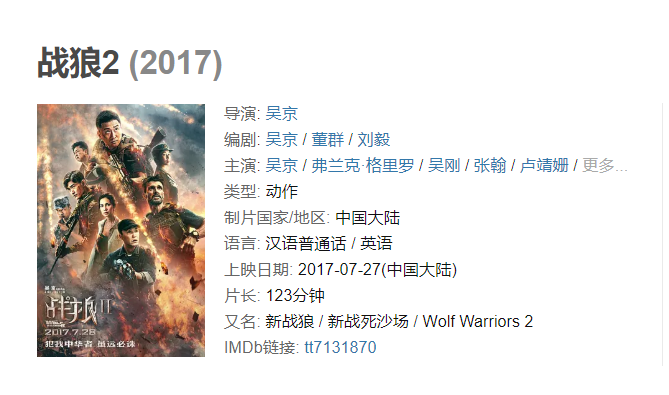

## 基于内容的推荐算法（Content-Based）

#### 简介

基于内容的推荐方法是非常直接的，它以物品的内容描述信息为依据来做出的推荐，本质上是基于对物品和用户自身的特征或属性的直接分析和计算。

例如，假设已知电影A是一部喜剧，而恰巧我们得知某个用户喜欢看喜剧电影，那么我们基于这样的已知信息，就可以将电影A推荐给该用户。

#### 基于内容的推荐实现步骤

- **画像构建**。顾名思义，画像就是刻画物品或用户的特征。本质上就是给用户或物品贴标签。

  - **物品画像**：例如给电影《战狼2》贴标签，可以有哪些？

    

    "动作"、"吴京"、"吴刚"、"张翰"、"大陆电影"、"国产"、"爱国"、"军事"等等一系列标签是不是都可以贴上

  - **用户画像**：例如已知用户的观影历史是："《战狼1》"、"《战狼2》"、"《建党伟业》"、"《建军大业》"、"《建国大业》"、"《红海行动》"、"《速度与激情1-8》"等，我们是不是就可以分析出该用户的一些兴趣特征如："爱国"、"战争"、"赛车"、"动作"、"军事"、"吴京"、"韩三平"等标签。

###### 问题：物品的标签来自哪儿？

1. PGC    物品画像--冷启动
   - 物品自带的属性（物品一产生就具备的）：如电影的标题、导演、演员、类型等等
   - 服务提供方设定的属性（服务提供方为物品附加的属性）：如短视频话题、微博话题（平台拟定）
   - 其他渠道：如爬虫
2. UGC    冷启动问题
   - 用户在享受服务过程中提供的物品的属性：如用户评论内容，微博话题（用户拟定）

根据PGC内容构建的物品画像的可以解决物品的冷启动问题

###### 基于内容推荐的算法流程：

- 根据PGC/UGC内容构建物品画像
- 根据用户行为记录生成用户画像
- 根据用户画像从物品中寻找最匹配的TOP-N物品进行推荐

###### 物品冷启动处理：

- 根据PGC内容构建物品画像
- 利用物品画像计算物品间两两相似情况
- 为每个物品产生TOP-N最相似的物品进行相关推荐：如与该商品相似的商品有哪些？与该文章相似文章有哪些？

